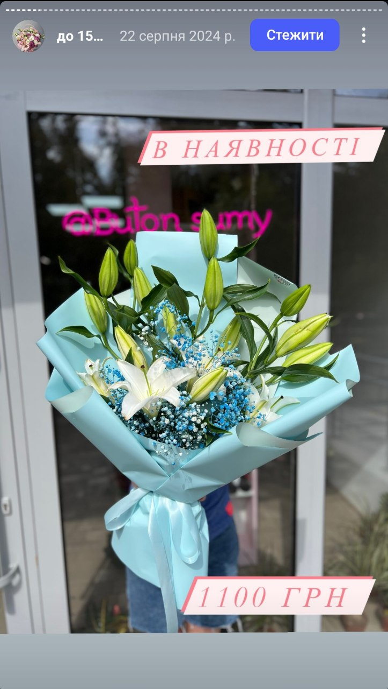

# UI-UX-Practice

# Практичне завдання 1: Оптимізація зображень за допомогою Squoosh

## Аналіз вихідних файлів

### Фотографія:
- **Розмір:** 3056 x 3056
- **Формат:** JPG
- **Вага файлу:** 2,18 МБ

### Скріншот:
- **Розмір:** 723 x 1280
- **Формат:** JPG
- **Вага файлу:** 139 КБ

### Графічне зображення з текстом:
- **Розмір:** 626 x 626
- **Формат:** JPG
- **Вага файлу:** 18,2 КБ

## Стиснення без втрати якості (lossless)

| Формат | Фотографія | Скріншот | Графічне зображення |
|--------|------------|------------|----------------------|
| **PNG (lossless)** | 9,59 МБ | 1,10 МБ | 145 КБ |
| **WebP (lossless)** | 4,36 МБ | 563 КБ | 82,6 КБ |

## Стиснення з втратою якості (lossy)

| Формат | Якість | Фотографія | Скріншот | Графічне зображення |
|--------|--------|------------|------------|----------------------|
| **MozJPEG** | 100% | 3,02 МБ | 367 КБ | 69,3 КБ |
|  | 75% | 719 КБ | 86 КБ | 14,1 КБ |
|  | 50% | 443 КБ | 55,6 КБ | 10,3 КБ |
| **WebP (lossy)** | 100% | 2,56 МБ | 212 КБ | 30,7 КБ |
|  | 75% | 525 КБ | 60,4 КБ | 10,1 КБ |
|  | 50% | 375 КБ | 45,8 КБ | 8 КБ |
| **AVIF** | 100% | 2,30 МБ | 199 КБ | 31,9 КБ |
|  | 75% | 729 КБ | 74,4 КБ | 11,4 КБ |
|  | 50% | 314 КБ | 39 КБ | 5,63 КБ |

## Оптимізація розміру відповідно до цільового використання

| Ширина | Фотографія | Скріншот | Графічне зображення |
|--------|------------|------------|----------------------|
| **1200 px** | 1,20 МБ | 1,52 МБ | 295 КБ |
| **600 px** | 347 КБ | 520 КБ | 105 КБ |
| **2x версія** | 14,1 МБ | 1,95 МБ | 313 КБ |

## Висновки

1. **Найкращі формати для кожного типу зображень:**
    - **Фотографія:** WebP (lossless) для збереження якості, WebP (lossy) при 50% якості для веб.
    - **Скріншот:** PNG (lossless) для збереження деталей, WebP (lossy) при 50% якості для веб.
    - **Графіка з текстом:** WebP (lossless) для якості, AVIF при 50% якості для веб.

2. **Вплив зміни розміру на оптимізацію:**
    - Зменшення розміру значно знижує вагу файлу, що прискорює завантаження веб-сторінок.
    - Важливо враховувати цільове використання, щоб зображення не втратило функціональність.

3. **Адаптація для Retina-дисплеїв:**
    - Використання 2x роздільної здатності забезпечує чіткість на високоякісних екранах.
    - Формати WebP та AVIF добре підходять для балансування між якістю та розміром файлу.